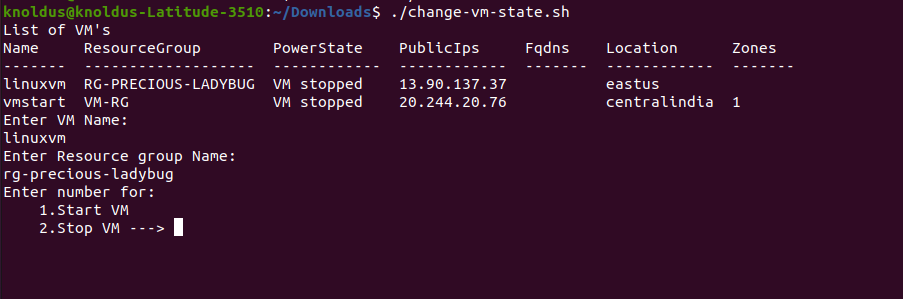

## Description

Here, In this template we will change the state of Azure VM using the shell script.

---

#### Pre-requisite

* AZ Account
* Azure CLI

---

### Steps:-
1. Login into AZ account using `az login` or `az login --tenant <TENANT-ID>`
2. Change the permission of the file `chmod a+x change-vm-state.sh`
3. Go to the terminal and run the command `./change-vm-state.sh`

---

### Outputs
Here, In this output it's showing the list of VM's and choice to change the state:

Here, In this output it's giving already in the same state:

Here, In this output it's changing the state of VM:

---
